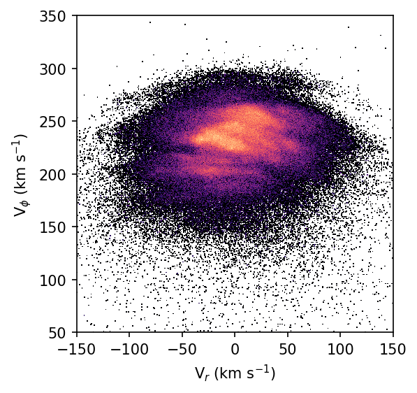

# MGwave

Wavelet transformation code to enable detection of kinematic moving groups in astronomical data.

# Installation

## Dependencies

MGwave requires several common python packages:

- numpy
- matplotlib
- scipy
- seaborn
- tqdm

MGwave also makes use of the Starlet transformation developed by J.L. Starck and F. Murtagh ("Image Restoration with Noise Suppression Using the Wavelet Transform", Astronomy and Astrophysics, 288, pp-343-348, 1994). It has been implemented in Python by Michael Broxton ([https://github.com/broxtronix/pymultiscale](https://github.com/broxtronix/pymultiscale)).
It has been updated to work with Python 3 and is included in this package source.

## Local pip installation

The recommended installation method for MGwave is to clone the git repo to your computer, and then use pip to install the package locally.

```bash
$> git clone https://github.com/DOnghiaGroup/MGwave.git
$> python3 -m pip install -e ./MGwave/
```

The `-e` argument allows for live updating of the package upon modification of the source. You can leave it out if you don't plan to edit the source python.

# Usage

## Basic wavelet transformation

Import MGwave into your python project using

```python
import MGwave as wave
```

The main function is run_wavelet(). It will create a histogram of the input data, then perform the wavelet transformation at the specified scales, returning the wavelet coefficients across the entire histogram in addition to information about the detected extrema. The use case showcased in the methods paper **cite paper here** is to detect overdensities and underdensities in the kinematic plane of astronomical data from the *Gaia* satellite. This is implemented using the following commands.

```python
img,wt,maximum,minimum,indexmax,indexmin = wave.run_wavelet(vr, vphi, bands=[3,4], bins=[600,600],
				plot_range=[[-150,150],[50,350]], extrema=True, verbose=True, extra_output=True)
h,xe,ye=img
```

`vr` and `vphi` are the radial and azimuthal velocities of the stars from *Gaia* and are the `x` and `y` axes of the histogram we are creating. `bands` specifies the scales of the wavelet transformation (the size of detected structures are between `2**(bands)` and `2**(bands+1)` in pixels). In order to determine the desired bands, you must take into consideration the desired size of structures you wish to detect in addition to the bin size and plot_range to transform from physical units to pixels. For the example above, our entire plot range covers 300 km s<sup>-1</sup> in x and y, so our bin size is 0.5 km s<sup>-1</sup> in each dimension. Therefore, for `band=3` we are detecting structures between `(2**3)*0.5=4` and `(2**4)*0.5=8` km s<sup>-1</sup>. The `extrema` argument determines whether the code will search for local maxima and minima in the wavelet transformed histogram.

You can use

```python
?wave.run_wavelet
```
in a Jupyter notebook to see a full list of available parameters.

The output produced from `wave.run_wavelet` above consists of the results of the histogram creation (`img`), the wavelet coefficient images (`wt`), and information about the detected extrema in `maximum`, `minimum`, `indexmax`, and `indexmin`. Here is some example code to view the output.

```python
from matplotlib.colors import LogNorm
import matplotlib.pyplot as plt

fig,ax = plt.subplots(figsize=(5,4),dpi=150)
plt.pcolormesh(xe,ye,h.T,cmap='magma',norm=LogNorm())
plt.gca().set_aspect(1)
plt.xlabel(r"V$_r$ (km s$^{-1}$)")
plt.ylabel(r"V$_\phi$ (km s$^{-1}$)")
plt.show()
```


```python
import numpy as np
from matplotlib.colors import PowerNorm

# select band = 4
i=1
# split up all positive and negative wavelet coefficients
# we need to split them so that we can plot them using PowerNorm()
wtpos = np.array(wt[i])
wtpos[np.where(wt[i] <= 0)] = np.nan
wtneg = np.array(wt[i])
wtneg[np.where(wt[i] >= 0)] = np.nan

wtpos = np.abs(wtpos)
wtneg = np.abs(wtneg)

fig,ax = plt.subplots(figsize=(5,4),dpi=150)

# positive coefficients are shown in purple, and negative coefficients are shown in green
plt.pcolormesh(xe,ye,wtpos,cmap="Purples",norm=PowerNorm(0.5,vmax=np.nanmax(wtpos.reshape(-1))*1.3))
plt.pcolormesh(xe,ye,wtneg,cmap="Greens",norm=PowerNorm(0.5,vmax=np.nanmax(wtpos.reshape(-1))*1.3))
plt.gca().set_aspect(1)
plt.xlabel(r"V$_r$ (km s$^{-1}$)")
plt.ylabel(r"V$_\phi$ (km s$^{-1}$)")
plt.show()
```


Here we will look at the structure of the `maximum`, `minimum`, `indexmax`, and `indexmin` output variables. Note that the columns of these arrays will vary depending on what parameters are passed into `wave.run_wavelet`. In this case, we have `run_simulations=False` and `extra_output=True`, so our columns are:

| x-location | y-location | significance value | wavelet coefficient | number of stars used to calculate wavelet |
|---|---|---|---|---|
The last two columns are included because of `extra_output=True`.

```python

# determine confidence level from the calculated significances of each maximum
cl = wave.get_cl(maximum[i][:,2])

# sort output by wavelet coefficient
sortmask = maximum[i][:,3].argsort()
sortedmaximum = maximum[i][sortmask][::-1]
sorted_cl = cl[sortmask][::-1]

# print a table of output
print("       V_r   V_phi  CL   sig     Wavelet  n")
for j,m in enumerate(sortedmaximum):
    print("{:3}: {:6.1f}  {:6.1f}  {:1.0f}  {:.4f}  {:7.4f}  {:3.0f}"
          .format(j,m[0],m[1],sorted_cl[j],m[2],m[3],m[4]))
```

|      |  V_r   | V_phi  | CL|  sig   | Wavelet |  n  |
|  ---:|    ---:|    ---:|:---:|  ---:|     ---:| ---:|
|   0: |  -23.0 |  235.5 | 3 | 1.0000 |  7.7967 | 395 |
|   1: |   -2.5 |  228.5 | 3 | 1.0000 |  5.7164 | 469 |
|   2: |   19.5 |  256.0 | 3 | 1.0000 |  4.9928 | 387 |
|   3: |    0.5 |  246.5 | 3 | 1.0000 |  3.0392 | 548 |
|   4: |  -24.0 |  203.0 | 3 | 1.0000 |  2.0979 | 169 |
|   5: |   53.5 |  227.0 | 3 | 1.0000 |  1.5208 | 158 |
|   6: |   30.5 |  227.5 | 3 | 1.0000 |  1.2450 | 265 |
|   7: |   63.0 |  253.0 | 3 | 1.0000 |  0.5628 |  80 |
|   8: |  -71.0 |  203.0 | 3 | 1.0000 |  0.5473 |  46 |
|   9: |   52.0 |  257.5 | 3 | 1.0000 |  0.4707 | 108 |
|  10: |   16.0 |  199.0 | 3 | 1.0000 |  0.2713 | 111 |
| ⋮    |        |        |   |        |         |     |

## Monte Carlo simulations

MGwave also has the capabilities to run Monte Carlo simulations to propagate uncertainties in the supplied `x` and `y` values (radial velocity and azimuthal velocity in the above example). It will run the wavelet transformation on simulated data (pulled from gaussian distributions) many times and track the percentage of the simulations in which a given extrema is detected. This quantifies whether a detected overdensity or underdensity is robust to variations of the data within the provided errors.

These simulations are run with the same `wave.run_wavelet` function, however there are several additional arguments that need to be supplied:

```python
img,wt,maximum,minimum,indexmax,indexmin = wave.run_wavelet(vr, vphi, bands=[3,4], bins=[600,600],
				plot_range=[[-150,150],[50,350]], extrema=True, verbose=True, extra_output=True,
				x_error=vr_err, y_error=vphi_err, run_simulations=True, N=2000, multiprocessing=True)
h,xe,ye=img
```
Here we have specified the radial velocity and azimuthal velocity errors in the `x_error` and `y_error` arguments, and set `run_simulations` to `True`. `N=2000` specifies that we wish to run 2000 simulations, and `multiprocessing=True` enables the use of the python multiprocessing module to run the code across multiple cores (if available).

The output here is the same as above, except the `maximum`, `minimum`, `indexmax`, and `indexmin` output have an additional column:

| x-location | y-location | significance value | percentage of Monte Carlo sims | wavelet coefficient | number of stars |
|---|---|---|---|---|---|

# Resources

Starck, J.-L., Murtagh, F., Bijaoui, A. (1998) [http://www.multiresolution.com/cupbook.pdf](http://www.multiresolution.com/cupbook.pdf)  
Slezak, E., de Lapparent, V., & Bijaoui, A. (1993) ApJ, 409, 517 [https://ui.adsabs.harvard.edu/abs/1993ApJ...409..517S/abstract](https://ui.adsabs.harvard.edu/abs/1993ApJ...409..517S/abstract)
